# CodeServer IDE Walkthrough Talk

- [x] Create an EC2 machine with security group 22, 80, 443, 8080
- [x] Install CodeServer & run it on 8080
- [x] Run CodeServer as a Service
      (needed to offer direct ssh access to the machine)
- [x] Install Docker, DockerCompose, HumbleCLI
- [x] Run a simple Traefik instance on port 80 (via DockerCompose)
- [x] Proxy an NGiNX instance through Traefik (via DockerCompose)
- [x] Proxy CodeServer via NGiNX and Traefik (via DockerCompose)
- [ ] Aim a DNS towards the machine using CloudFlare
      (let’s just do it via REST call using Postmand and cURL)
- [ ] Configure Traefik to generate Letsencrypt certificates (via DockerCompose)

## Create an EC2 machine

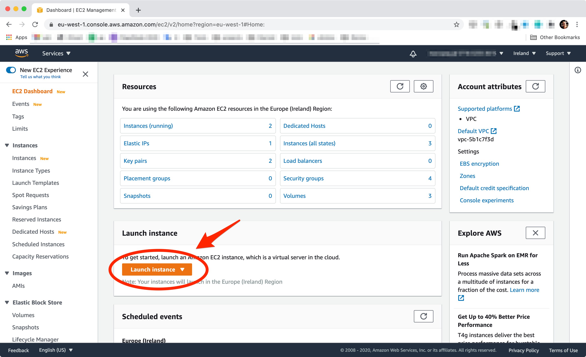

### Step 1: Choose an Amazon Machine Image (AMI)

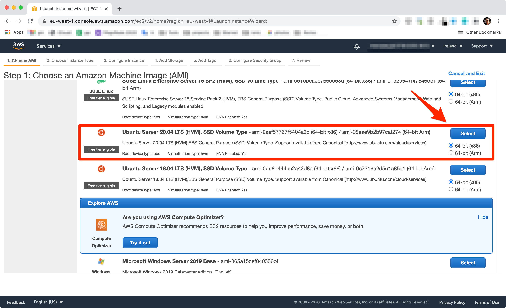

### Step 2: Choose an Instance Type

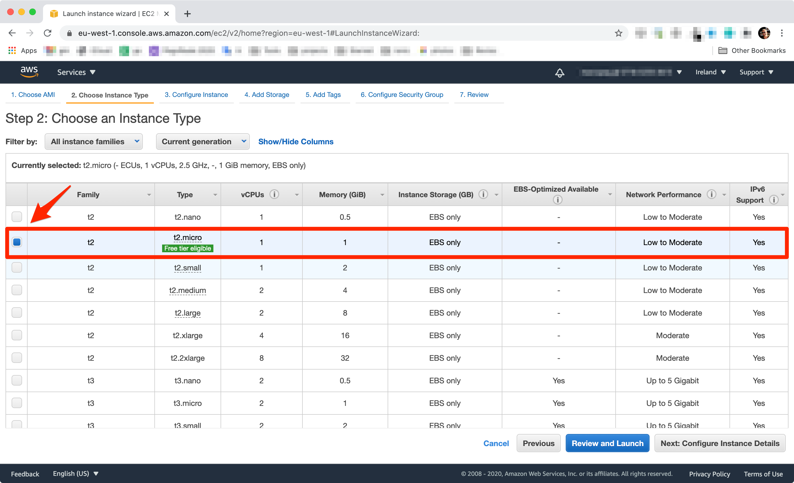

### Step 3: Configure Instance Details

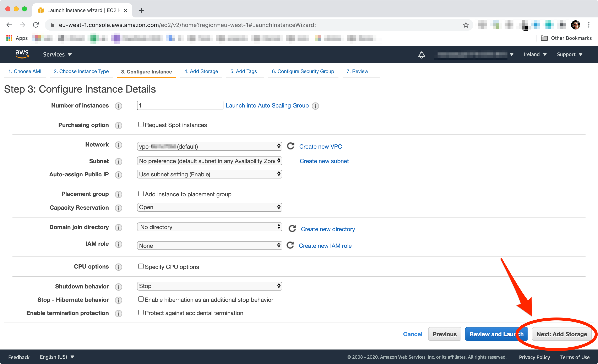

### Step 4: Add Storage

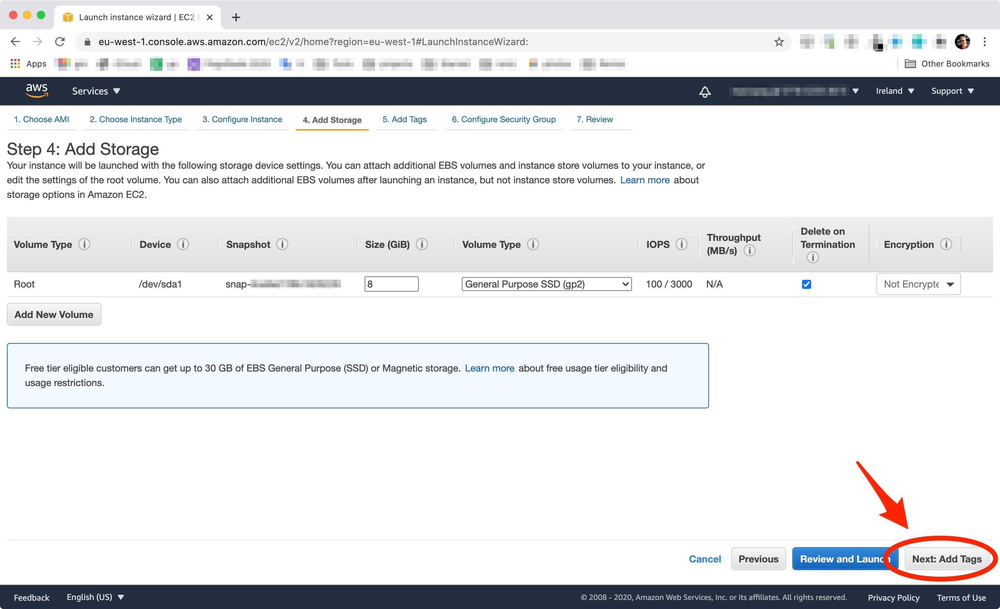

### Step 5: Add Tags

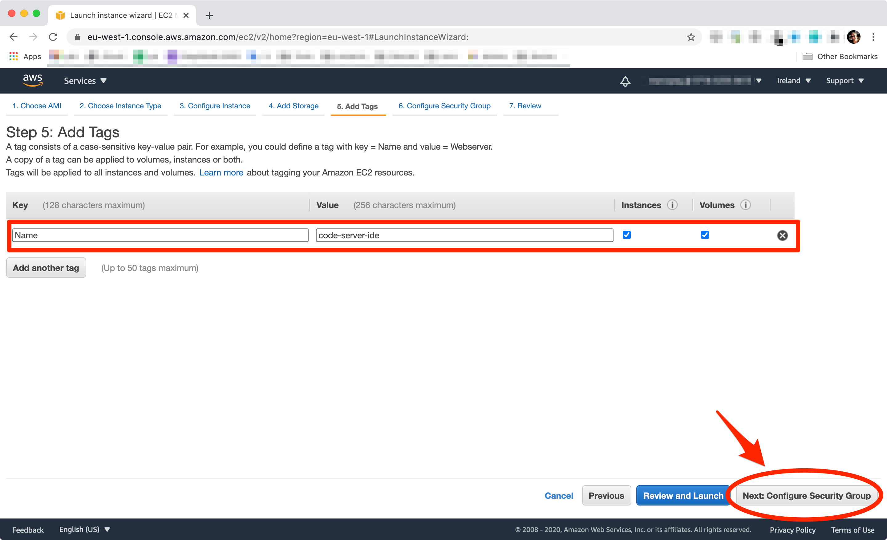

### Step 6: Configure Security Group

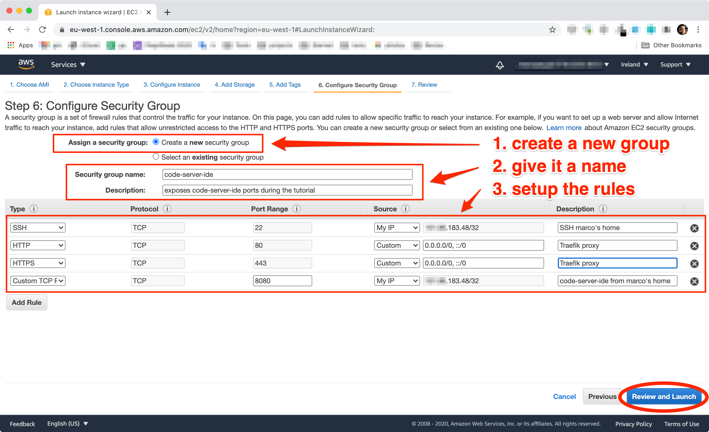

### Step 7: Review Instance Launch


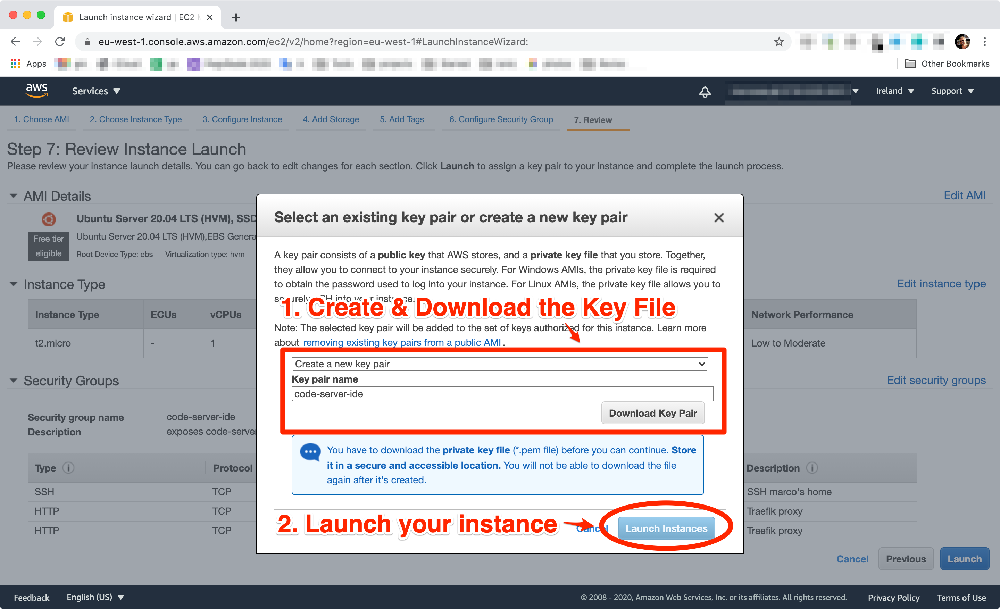

### Check the machine status

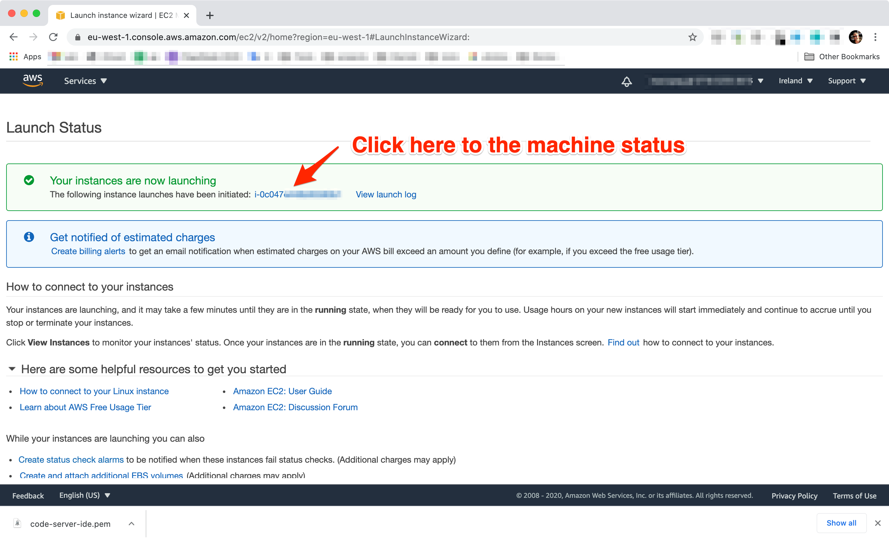

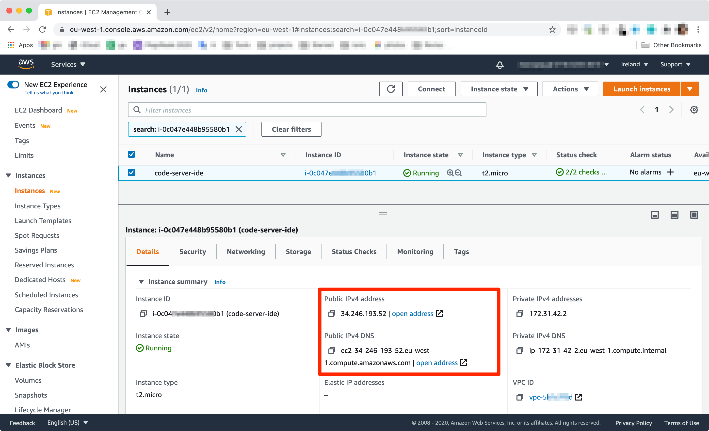

### Connect via SSH

Before attempting your first connection, you need to set the proper permissions to the _PEM KEY_ that you downloaded previously. AWS checks on this very detail as mandatory security requirement.

```bash
chmod 400 ~/Downloads/code-server-ide.pem
```

From now on, you can use the following command to get _SSH_ access to your newly created EC2 instance:

```bash
ssh -i ~/Downloads/code-server-ide.pem ubuntu@xx.xx.xx.xx
```

> 👉 The first time you connect, you will be prompted to
> accept the host's fingerprint. That 
> [increases security](https://www.phcomp.co.uk/Tutorials/Unix-And-Linux/ssh-check-server-fingerprint.html).

> 👉 It is important to point out that we choose "My IP" as origin for
> any SSH connections in _Step 6: Configure Security Group_. If you are
> attempting to connect from a different IP (maybe your phone or you
> went to meed you grandmother), you need to update that setting in the
> _Security Group_ configuration.
  
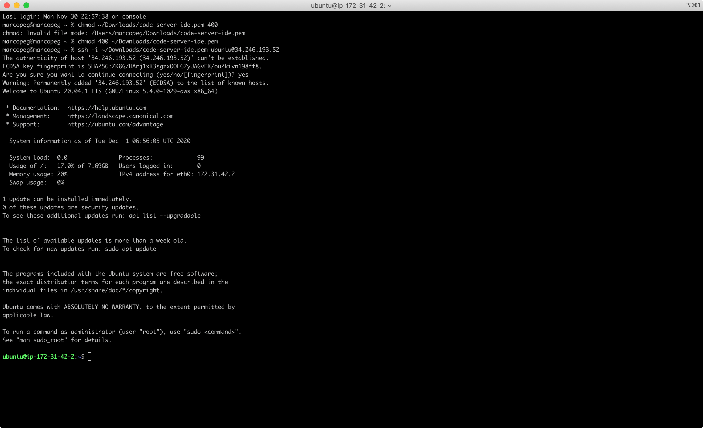

## Point a DNS to the Machine

[[ TO BE COMPLETED ]]

## Install CodeServer

To install CodeServer we follow the steps from their [official documentation](https://github.com/cdr/code-server/blob/v3.7.3/doc/install.md):

```bash
curl -fsSL https://code-server.dev/install.sh | sh -s
```

All the necessary files will be installed under your home directory (`/home/ubuntu`), therefore, there is no need for `sudo` while installing CodeServer.

The next step is to perfor a first run of CodeServer and try to reach it via browser:

```bash
code-server --host 0.0.0.0
```

> 👉 The parameter `--host` is necessary to bind the 
> service to the machine's port. It is also important that
> such port is properly set up in the machine's
> _Security Group_ so **to be reachable from your IP**.

Then copy your EC2 Instance's _Public IPv4 DNS_ (see the step "check the machine statu") and paste it in your browser aiming to port `8080`:

```bash
# Run this in your machine's terminal:
echo "http://$(curl -s -m 0.1 http://169.254.169.254/latest/meta-data/public-hostname):8080"

# You should get something like:
# http://ec2-xx-xx-xx-xx.eu-west-1.compute.amazonaws.com:8080
```

> 👉 It is important that you use `http` (NOT `https`) as
> we don't have an SSL certificate yet installed.
> We'll do that later on.

If everything works fine, you should see the login screen:

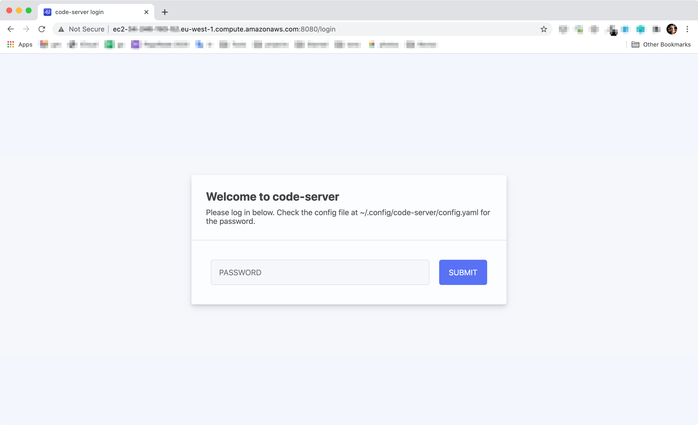

In order to retrieve the auto-generated password you can run:

```bash
echo $(grep "password:" ~/.config/code-server/config.yaml | tail -1 | cut -c10-100)
```

> 👉 You need to stop the running process:
> 1. Use `Ctrl+c` to stop the running CodeServer
> 2. run the password command and copy it
> 3. start CodeServer again to be able to login

In order to change the default password, you can edit the file `~/.config/code-server/config.yaml`, then restart CodeServer.

When everything works, you should be able to login and verify that your CodeServer works fine:

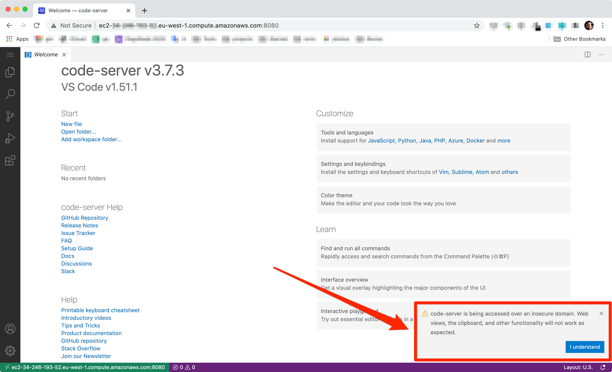

## Run CodeServer as a Service

Looking at the [ufficial documentation](https://github.com/cdr/code-server/blob/v3.7.4/doc/install.md),
to run CodeServer as a resident service (resilient to the machine reboot) looks quite a trivial task:

```bash
sudo systemctl enable --now code-server@$USER
```

Nevertheless, if you just run it this way, your CodeServer won't be exposed to the Internet, because
the default configuration (`~/.config/code-server/config.yaml`) binds it to the localhost (`127.0.01`).

The following command will set CodeServer to any incoming traffic on port `8080` and restart the 
background process so to apply the changes,

```bash
sed -i 's/127.0.0.1:8080/0.0.0.0:8080/g' ~/.config/code-server/config.yaml
sudo systemctl restart code-server@$USER
```

You can check the contents that we applied to the configuration file with:

```bash
cat ~/.config/code-server/config.yaml
```

And, of course, you can revert the binding at any time, so to avoid exposing unnecessary surface for
attackers, by running the opposite `sed` instruction (we will do this later anyway):

```bash
sed -i 's/0.0.0.0:8080/127.0.0.1:8080/g' ~/.config/code-server/config.yaml
sudo systemctl restart code-server@$USER
```

> 👉 The next step would be to proxy Internet traffic to our CodeServer
> instance without exposing it directly. Hopefully this is an easy task
> with [Docker][docker] and [Traefik][traefik].

## Install Docker, DockerCompose, HumbleCLI

Installing [Docker][docker] is not a big deal any longer thanks to these
wonderful tutorials by [Digitalocean]:

- [How To Install and Use Docker on Ubuntu 20.04](https://www.digitalocean.com/community/tutorials/how-to-install-and-use-docker-on-ubuntu-20-04)
- [How To Install and Use Docker on Ubuntu 18.04](https://www.digitalocean.com/community/tutorials/how-to-install-and-use-docker-on-ubuntu-18-04)

Nevertheless, this is my compact recipe:

```bash
# Install Docker
sudo apt update -y
sudo apt install -y docker.io
sudo systemctl enable --now docker

# Enable Docker for the "ubuntu" user
# (so that we don't have to run "sudo" with Docker)
sudo usermod -aG docker ubuntu

# You need to logout/login into your machine to apply
# the change to the user's rights:
exit
```

[Docker Compose][docker-compose] is much simpler than that and doesn't
require any kind of logout/login:

```bash
# Download the latest version from GitHub
sudo apt install -y jq
sudo curl -o /usr/local/bin/docker-compose -L "https://github.com/docker/compose/releases/download/$(curl --silent https://api.github.com/repos/docker/compose/releases/latest | jq .name -r)/docker-compose-$(uname -s)-$(uname -m)"

# Make it executable:
chmod +x /usr/local/bin/docker-compose
```

Optionally, you may want to install [HumbleCLI][humble] which is a small
wrapper around DockerCompose and may facilitate the running of local projects:

```bash
git clone https://github.com/marcopeg/humble-cli.git /home/ubuntu/.humble-cli
sudo ln -s /home/ubuntu/.humble-cli/bin/humble.sh /usr/local/bin/humble
 ```

> 👉 The next step would be to leverage Docker so to proxy CodeServer
> to the standard port `80`...

## Proxy CodeServer with Docker and NGiNX

_Why can't I leave my CodeServer exposed to 8080?_  
I'm glad you asked. Here are a few reasons:

1. It's simply easier to access it on standard port `80`
2. With a proxy like [NGiNX][nginx], we could add _SSL protection_ to it
3. With [NGiNX][nginx] (and some work) we can proxy multiple services

> 👉 In this step we will try to proxy the CodeServer process through
> [NGiNX][nginx], but later on we will also add [Traefik][traefik] that
> will make all the configuration a simple docker-based automation.

The beauty of running services via [Docker Compose][docker-compose] is that you can experience the real
**SaaS - Software as a Software** experience where you
describe what you want to run and how you want to run it in the form of source files.

```bash
# Generate the basic configuration for NGiNX
cat <<EOT > ~/nginx.conf
server {
  listen 80;
  server_name _;

  location / {
      proxy_pass http://127.0.0.1:8080/;
      proxy_set_header X-Real-IP \$remote_addr;
      proxy_set_header X-Forwarded-For \$proxy_add_x_forwarded_for;
      proxy_set_header Host \$http_host;
      proxy_set_header X-NginX-Proxy true;

      proxy_http_version 1.1;
      proxy_set_header Upgrade \$http_upgrade;
      proxy_set_header Connection "upgrade";
      proxy_redirect off;
  }
}
EOT
```

```bash
# Generate the basic Docker Compose project
cat <<EOT > ~/docker-compose.yml
version: "3.7"
services:
  nginx:
    image: nginx:1.19.5-alpine
    network_mode: host
    ports:
      - "80:80"
    volumes:
      - "~/nginx.conf:/etc/nginx/conf.d/default.conf"
EOT
```

Now you can copy your host's default _DNS_ to your browser:

```bash
echo "http://$(curl -s -m 0.1 http://169.254.169.254/latest/meta-data/public-hostname)"
```

And start the [Docker Compose][docker-compose] project:

```bash
docker-compose up
```

If everything works fine you should be able to see a screen like the following one:

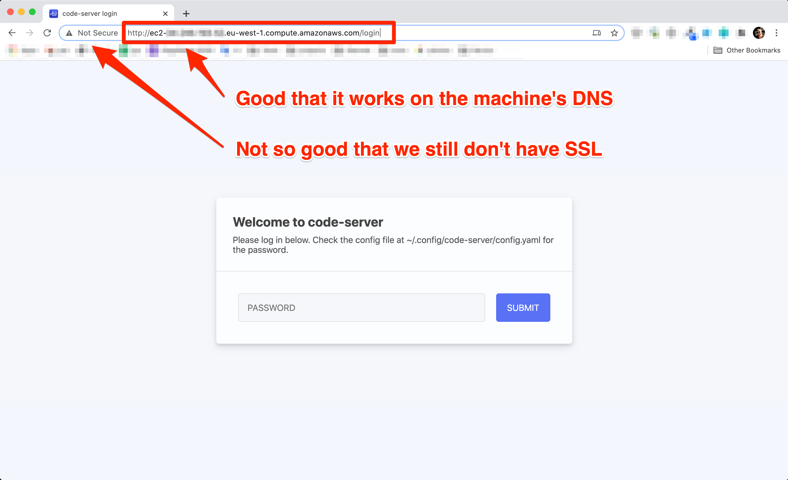

> 👉 Now that we learned how to proxy [CodeServer][code-server] via
> [NGiNX][nginx], we can revert the change we made to its configuration
> and avoid exposing it directly:

```bash
sed -i 's/0.0.0.0:8080/127.0.0.1:8080/g' ~/.config/code-server/config.yaml
sudo systemctl restart code-server@$USER
```

> 👉 In the next step, we'll add [Traefik][traefik] to the 
> [Docker Compose][docker-compose] project and set it up so to
> automatically generate a [Letsencrypt][letsencrypt] SSL certificate
> for our **Cloud Development Environment**.

## Handle Multiple Services With Traefik

[Traefik][traefik] is a **zero config reverse proxy** that goes extremely well with
[Docker][docker] as it can listen to running containers and automagically adapt so to
route traffic to them.

The following [Docker Compose][docker-compose] file is the bare miminum that is needed
to run [Traefik][traefik]:

```bash
# Generate the basic Docker Compose project
cat <<EOT > ~/docker-compose.yml
version: "3.7"
services:
  traefik:
    image: traefik:v2.3
    command:
      - "--api.dashboard=true"
      - "--api.insecure=true"
      - "--providers.docker.exposedbydefault=false"
      - "--providers.docker.network=web"
      - "--entrypoints.web.address=:80"
    ports:
      - 80:80
      - 8080:8080
EOT
```

It spins up [Traefik][traefik] and configures it so to listen to the [Docker][docker] daemon
for new containers coming up, or existing one going away. When Docker changes, Traefik will adapt to it.

> 👉 In order to try this configuration, you first need to stop your [CodeServer][code-server] service that
> is running in background, as Traefik also needs to serve contents to port `8080`.

```bash
# Stop Code Server:
sudo systemctl stop code-server@$USER

# Stop and remove any running container:
docker stop $(docker ps -a -q) && docker rm $(docker ps -a -q)

# Run the new project:
docker-compose up
```

Now you can open your machine's DNS to port 8080:

```bash
echo "http://$(curl -s -m 0.1 http://169.254.169.254/latest/meta-data/public-hostname):8080"
```

and get a result similar to the one in this picture:

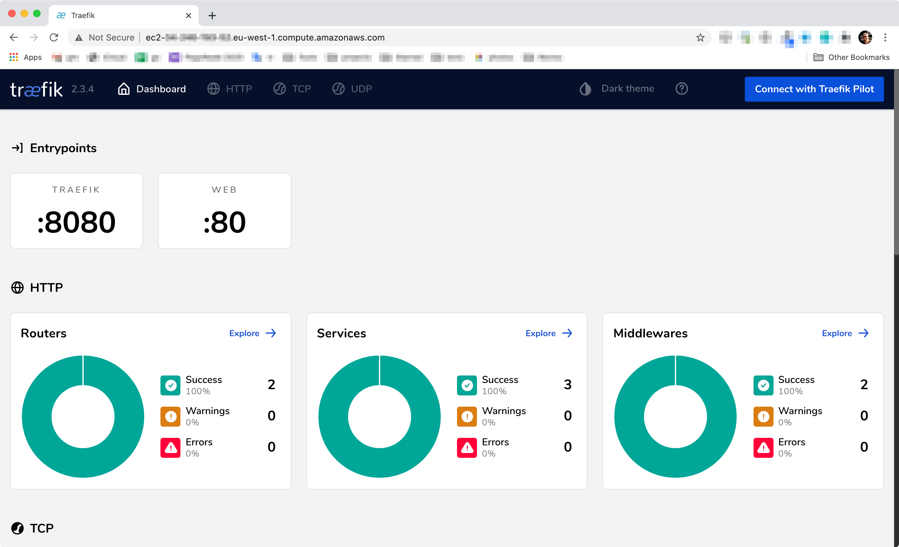

The next step is to work on this [Docker Compose][docker-compose] project and add more services to it, and to learn how to route them using labels:

```bash
# Generate the basic Docker Compose project
cat <<"EOT" > ~/docker-compose.yml
version: "3.7"
services:

  # Traefik Proxy Service
  traefik:
    image: traefik:v2.3
    command:
      - "--api.dashboard=true"
      - "--api.insecure=true"
      - "--providers.docker.exposedbydefault=false"
      - "--providers.docker.network=web"
      - "--entrypoints.web.address=:80"
    ports:
      - 80:80
      - 8080:8080
    volumes:
      - /var/run/docker.sock:/var/run/docker.sock:ro

  # A Web Application
  app1:
    image: nginx:1.19-alpine
    labels:
      - "traefik.enable=true"
      - "traefik.http.routers.app1.entrypoints=web"
      - "traefik.http.routers.app1.rule=PathPrefix(`/`)"
EOT
```

> 👉 Please note that for this to work we had to give
> Traefik direct access to the Docker's socker file
> in _read-only_ mode.

```bash
docker stop $(docker ps -a -q) && docker rm $(docker ps -a -q)
docker-compose up
```

With this project running, you should be still able to access the Traefik's console at port `8080`, and an _NGiNX welcome page_ at port `80`.

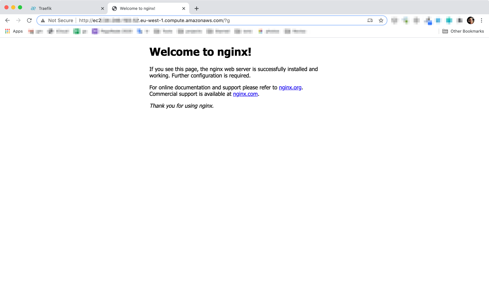

If you click on the `Explore ->` link in the _Routers_ panel, you will end up in a page that lists all the routing rules that Traefik was able to pick up from Docker:

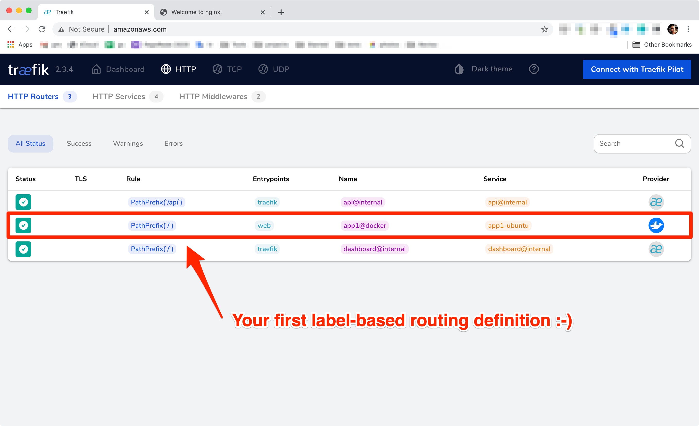

So far, we we simply managed to route a new container through Traefik (just another container) using only [container's labels](https://adilsoncarvalho.com/use-labels-on-your-docker-images-3abe4477e9f5). It is now time to explore some more interesting possibilities.

With the following [Docker Compose][docker-compose] project we are going to:

1. remove the need for port `8080`  
   <small>(we want to youse it for [Code Server][code-server], and we don't really want to expose it directly!)</small>
2. route Traefik's dashboard with Traefik itself
3. route an NGiNX app as `/app1`
4. route an Apache app as `/app2`

```bash
cat <<"EOT" > ~/docker-compose.yml
version: "3.7"
services:

  # Traefik Proxy Service
  traefik:
    image: traefik:v2.3
    command:
      - "--api.dashboard=true"
      - "--providers.docker.exposedbydefault=false"
      - "--providers.docker.network=web"
      - "--entrypoints.web.address=:80"
    ports:
      - 80:80
    volumes:
      - /var/run/docker.sock:/var/run/docker.sock:ro
    labels:
      - "traefik.enable=true"
      - "traefik.http.services.traefik.loadbalancer.server.port=1337"
      - "traefik.http.routers.traefik.entrypoints=web"
      - "traefik.http.routers.traefik.service=api@internal"
      - "traefik.http.routers.traefik.rule=PathPrefix(`/`)"

  # A Web Application
  app1:
    image: nginx:1.19-alpine
    labels:
      - "traefik.enable=true"
      - "traefik.http.routers.app1.entrypoints=web"
      - "traefik.http.routers.app1.rule=PathPrefix(`/app1`)"
      - "traefik.http.routers.app1.middlewares=app1-stripprefix"
      - "traefik.http.middlewares.app1-stripprefix.stripprefix.prefixes=/app1"

  # Another Web Application
  app2:
    image: httpd:2.4.41-alpine
    labels:
      - "traefik.enable=true"
      - "traefik.http.routers.app2.entrypoints=web"
      - "traefik.http.routers.app2.rule=PathPrefix(`/app2`)"
      - "traefik.http.routers.app2.middlewares=app2-stripprefix"
      - "traefik.http.middlewares.app2-stripprefix.stripprefix.prefixes=/app2"
EOT
```

> 👉 Remember to kill all running containers when you switch to a new project (while following this tutorial)

```bash
# Stop and remove any running container:
docker stop $(docker ps -a -q) && docker rm $(docker ps -a -q)
```

Once this is running, you should try to access the following urls:

```bash
http://your-dns/      -> Traefik console
http://your-dns/app1  -> NGiNX Welcome Page
http://your-dns/app2  -> Apache2 welcome page
```

If you explore again the Router's page you will notice that we have now a few more rules:

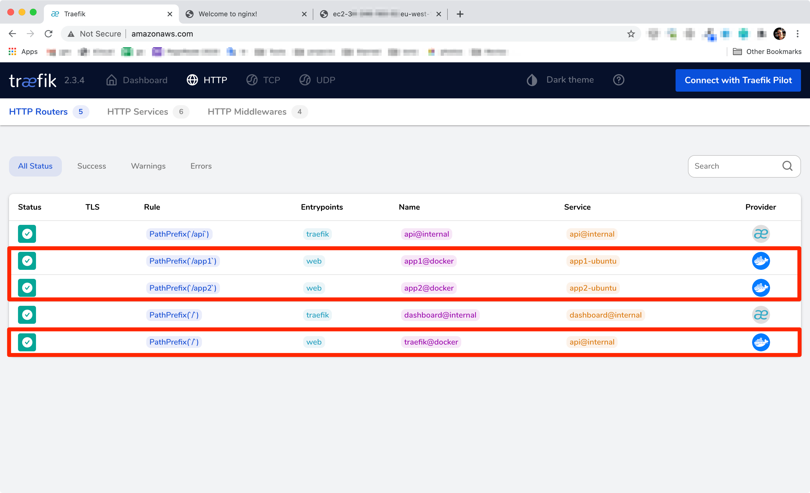

There are a few points worth of notice here:

1. Traefik is just a containers like others, so we can route it using Traefik's labels
2. Each containers must define a **unique router name**
3. We used a `PathPrefix` rule to explain how to rotue requests, but Traefik offers much more than this one
4. We configured middlewares that stripe away the subpath
rule that we use to identify a service. This is how we can extend Traefik's capabilities

Long story short, [Traefik][traefik] is really cool and I feel I just started to scratch the surface of it 😎🤟.

## Proxy CodeServer with Traefik

Now that we have the basics for running a reverse proxy and dynamically route traffik through it, it is about time that we setup our project to route CodeServer and the Traefik dashboard so that:

```bash
http://your-dns/         -> CodeServer IDE
http://your-dns/traefik  -> Traefik Dashboard
```

Here is the new [Docker Compose][docker-compose] project:

```bash
cat <<"EOT" > ~/docker-compose.yml
version: "3.7"
services:

  # Traefik Proxy Service
  traefik:
    image: traefik:v2.3
    command:
      - "--api.dashboard=true"
      - "--providers.docker.exposedbydefault=false"
      - "--providers.docker.network=web"
      - "--entrypoints.web.address=:80"
    volumes:
      - /var/run/docker.sock:/var/run/docker.sock:ro
    ports:
      - 80:80
    network_mode: host
    restart: on-failure
    labels:
      - "traefik.enable=true"
      - "traefik.http.services.traefik.loadbalancer.server.port=1337"
      - "traefik.http.routers.traefik.entrypoints=web"
      - "traefik.http.routers.traefik.service=api@internal"
      - "traefik.http.routers.traefik.rule=PathPrefix(`/traefik`) || PathPrefix(`/api`)"
      - "traefik.http.routers.traefik.middlewares=traefik-stripprefix"
      - "traefik.http.middlewares.traefik-stripprefix.stripprefix.prefixes=/traefik"

  nginx:
    image: nginx:alpine
    volumes:
      - ./nginx.conf:/etc/nginx/conf.d/default.conf
    network_mode: host
    restart: on-failure
    labels:
      - "traefik.enable=true"
      - "traefik.http.services.nginx.loadbalancer.server.port=8082"
      - "traefik.http.routers.nginx-http.entrypoints=web"
      - "traefik.http.routers.nginx-http.rule=PathPrefix(`/`)"
EOT
```

Before you run it, remember to restart the Code Server's background process:

```bash
# Stop and remove any running container:
docker stop $(docker ps -a -q) && docker rm $(docker ps -a -q)

# Restart Code Server
sudo systemctl restart code-server@$USER

# Run the Docker Compose project
docker-compose up -d
```

When everything works fine, you should be able to:

- run VSCode IDE from your machine's default DNS
- run the Terminal as you were running an SSH session
- add new containers to Docker and route them via labels

Cool, isn't it?

## Secure your IDE with Letsencrypt 

[Letsencrypt][letsencrypt] is a **non-profit Certificate Authority** that you can easily use in combination with [Traefik][traefik] so [make your web services secure](https://domain.me/what-is-an-ssl-certificate-and-why-is-it-important/).

> It is also a tremendous development benefit as you will be able to test any kind of API or third party that requires `https`.

👉 The thing is, from this momen on **you will need to use a custom _DNS_**. **Letsencrypt [doesn't support EC2 ](https://community.letsencrypt.org/t/policy-forbids-issuing-name-for-aws/95246)**. Luckyly

### Get your machine's Public IP

The first step in the process of setting up a custom domain name is to figure out the machines' Public IP. You can get this information from the EC2's details in AWD Console, otherwise, you can simply run the following command: 

```bash
echo $(curl -s icanhazip.com)
```

We are going to use this information in the next step.

### Setup an A Record in your DNS Panel

In case you own a domai name, please use your DNS provider's instruction to setup an `A Record` that points to your machine's IP.

If your provider offers the possibility to add SSL automatically ([CloudFlare][cloudflare] does) please void that option as we are going to protect the machine with Letsencrypt certificates.

### Setup a free 3rd level domain name

In case you **want to use a free domain name**, please:

1. create an account at [Afraid.org][afraid]
2. navigate to [Subdomains](https://freedns.afraid.org/subdomain/)
3. create an entry with one of the public domains and aim it to your machine's Public IP

> 👉 It took up to 15 minutes for me to see the DNS propagated with this free service. I suggest you also try to edit and re-save the entry. It worked for me to speed it up.

### Verify your DNS

Once you have configured your DNS, you can test it using [this tool](https://mxtoolbox.com/DNSLookup.aspx). You should get a result like this:

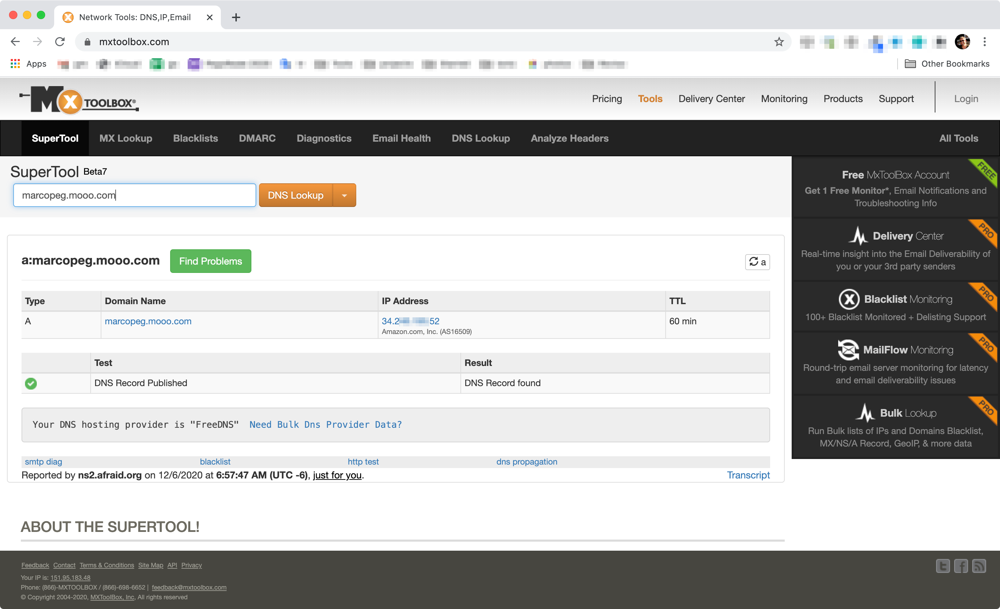

### Clear your DNS Cache

If you are running in any headache with local DNS pointing to weird provider's fallback pages, and you are using Chrome, [open the DNS panel](chrome://net-internals/#dns) and click on "Clear host cache".

### Setup Environment Variable

This step will enable us to use environmental variables inside our `docker-compose.yml`, making it a reusable piece of code that is easy to move from project to project.

In order to make the [Letsencrypt][letsencrypt] integration to work properly, we need to setup 2 pieces of information:

1. A valid email to use with the CA
2. A custom domain that point to the EC2 Instance

Here is an easy way to do it:

```bash
echo "export CODE_SERVER_EMAIL=foo@bar.com" >> ~/.profile
echo "export CODE_SERVER_DNS=foo.bar.com" >> ~/.profile
source ~/.profile
```

In order to test this, you can simply:

```bash
echo "${CODE_SERVER_EMAIL} - ${CODE_SERVER_DNS}"
```

### Run the Docker Compose Project

Finally, with all this preparation steps behind our back, it is time to update the [Docker-Compose] project so to integrate [Traefik] with [Letsencrypt] and enjoy the benefits of SSL 😎.

```bash
cat <<"EOT" > ~/docker-compose.yml
version: "3.7"
services:

  traefik:
    image: traefik:v2.3
    command:
      - "--api.dashboard=true"
      - "--providers.docker.exposedbydefault=false"
      - "--providers.docker.network=web"
      - "--entrypoints.http.address=:80"
      # SSL - Letsencrypt integration
      - "--entrypoints.https.address=:443"
      - "--certificatesresolvers.letsencrypt.acme.httpchallenge=true"
      - "--certificatesresolvers.letsencrypt.acme.httpchallenge.entrypoint=http"
      - "--certificatesresolvers.letsencrypt.acme.storage=/letsencrypt/acme.json"
      - "--certificatesresolvers.letsencrypt.acme.email=${CODE_SERVER_EMAIL}"
      # Force redirect http->https for every service
      # (comment to let each service definition the responsability over this detail)
      - "--entrypoints.http.http.redirections.entrypoint.to=https"
      - "--entrypoints.http.http.redirections.entrypoint.scheme=https"
    volumes:
      - /var/run/docker.sock:/var/run/docker.sock:ro
      - ./letsencrypt:/letsencrypt
    ports:
      - 80:80
      - 443:443
    network_mode: host
    restart: on-failure
    labels:
      - "traefik.enable=true"
      - "traefik.http.middlewares.traefik-stripprefix.stripprefix.prefixes=/traefik"
      # HTTP
      - "traefik.http.services.traefik-http.loadbalancer.server.port=1337"
      - "traefik.http.routers.traefik-http.entrypoints=http"
      - "traefik.http.routers.traefik-http.service=api@internal"
      - "traefik.http.routers.traefik-http.rule=Host(`${CODE_SERVER_DNS}`) && (PathPrefix(`/traefik`) || PathPrefix(`/api`))"
      - "traefik.http.routers.traefik-http.middlewares=traefik-stripprefix"
      # HTTPS
      - "traefik.http.routers.traefik-https.tls=true"
      - "traefik.http.routers.traefik-https.service=api@internal"
      - "traefik.http.routers.traefik-https.tls.certresolver=letsencrypt"
      - "traefik.http.routers.traefik-https.entrypoints=https"
      - "traefik.http.routers.traefik-https.rule=Host(`${CODE_SERVER_DNS}`) && (PathPrefix(`/traefik`) || PathPrefix(`/api`))"
      - "traefik.http.routers.traefik-https.middlewares=traefik-stripprefix"

  nginx:
    image: nginx:alpine
    volumes:
      - ./nginx.conf:/etc/nginx/conf.d/default.conf
    network_mode: host
    restart: on-failure
    labels:
      - "traefik.enable=true"
      # HTTP
      - "traefik.http.services.nginx-http.loadbalancer.server.port=8082"
      - "traefik.http.routers.nginx-http.entrypoints=http"
      - "traefik.http.routers.nginx-http.rule=PathPrefix(`/`)"
      # HTTPS
      - "traefik.http.routers.nginx-https.tls=true"
      - "traefik.http.routers.nginx-https.tls.certresolver=letsencrypt"
      - "traefik.http.routers.nginx-https.entrypoints=https"
      - "traefik.http.routers.nginx-https.rule=Host(`${CODE_SERVER_DNS}`) && PathPrefix(`/`)"
EOT
```

The main changes from the previous step are:

- We use _environmental variables_ to pass informations to our [Docker-Compose] project
- With [Letsencrypt] we must declare a `Host()` rule for which we want to generate a certificate
- We can use [Traefik]'s flags to set an automatic `http->https` redirect
- All our containers must declare both `http` and `https` definitions

## Run Wordpress on your Cloud IDE!

The last step would be to use our machine in order to run a completely new service!

> What do you think about running a Wordpress blog?  
> Well, with Docker of course!
> 😎

If you search ["docker wordpress" on Google](https://www.google.com/search?q=docker+wordpress), the first result will likely be the [Wordpress' Docker HUB page](https://hub.docker.com/_/wordpress). Running through it you will find a `docker-compose.yml` source that you can use to run the whole system in your development machine:

```yaml
version: '3.1'
services:
  wordpress:
    image: wordpress
    restart: always
    ports:
      - 8080:80
    environment:
      WORDPRESS_DB_HOST: db
      WORDPRESS_DB_USER: exampleuser
      WORDPRESS_DB_PASSWORD: examplepass
      WORDPRESS_DB_NAME: exampledb
    volumes:
      - wordpress:/var/www/html
  db:
    image: mysql:5.7
    restart: always
    environment:
      MYSQL_DATABASE: exampledb
      MYSQL_USER: exampleuser
      MYSQL_PASSWORD: examplepass
      MYSQL_RANDOM_ROOT_PASSWORD: '1'
    volumes:
      - db:/var/lib/mysql
volumes:
  wordpress:
  db:
```

This is _almost_ ready for working on our machine. So, what do we need to fill it up?

1. A DNS record for our blog, that aims to the machine's Public IP
2. We can remove the ports, as it will be proxied through [Traefik]
3. A `labels` section for the service `wordpress` that explains [Traefik] what to do with this service

You can create a free temporary DNS usign the [Afraid].org service, or you can setup your own. Once you are done, here is the [Docker-Compose] project to run and expose a Wordpress service:

```bash
cat <<EOT > ~/wordpress.yml
version: "3.7"
services:
  wordpress:
    image: wordpress
    restart: always
    environment:
      WORDPRESS_DB_HOST: db
      WORDPRESS_DB_USER: exampleuser
      WORDPRESS_DB_PASSWORD: examplepass
      WORDPRESS_DB_NAME: exampledb
    labels:
      - "traefik.enable=true"
      # HTTP
      - "traefik.http.routers.wordpress.entrypoints=http"
      - "traefik.http.routers.wordpress.rule=Host(`${WORDPRESS_DNS}`)"
      # HTTPS
      - "traefik.http.routers.wordpresss.tls=true"
      - "traefik.http.routers.wordpresss.tls.certresolver=letsencrypt"
      - "traefik.http.routers.wordpresss.entrypoints=https"
      - "traefik.http.routers.wordpresss.rule=Host(`${WORDPRESS_DNS}`)"
  db:
    image: mysql:5.7
    restart: always
    environment:
      MYSQL_DATABASE: exampledb
      MYSQL_USER: exampleuser
      MYSQL_PASSWORD: examplepass
      MYSQL_RANDOM_ROOT_PASSWORD: '1'
EOT
```

And you run it by passing the DNS you set up:

```bash
WORDPRESS_DNS=your.dns.mooo.com docker-compose -f wordpress.yml up
```

## Notes

```bash
sudo systemctl status code-server@$USER
sudo systemctl stop code-server@$USER
sudo systemctl restart code-server@$USER
sudo systemctl disable code-server@$USER
systemctl list-units --type=service
lsof -i :8080
export CODE_IDE_DNS=$(curl -s -m 0.1 http://169.254.169.254/latest/meta-data/public-hostname)
```

[code-server]: https://github.com/cdr/code-server
[docker]: https://www.docker.com/
[traefik]: https://traefik.io/
[nginx]: https://www.nginx.com/
[digitalocean]: https://m.do.co/c/0a72735ae62e
[docker-compose]: https://docs.docker.com/compose/
[humble]: https://github.com/marcopeg/humble-cli
[letsencrypt]: https://letsencrypt.org/
[cloudflare]: https://www.cloudflare.com/
[afraid]: https://freedns.afraid.org/