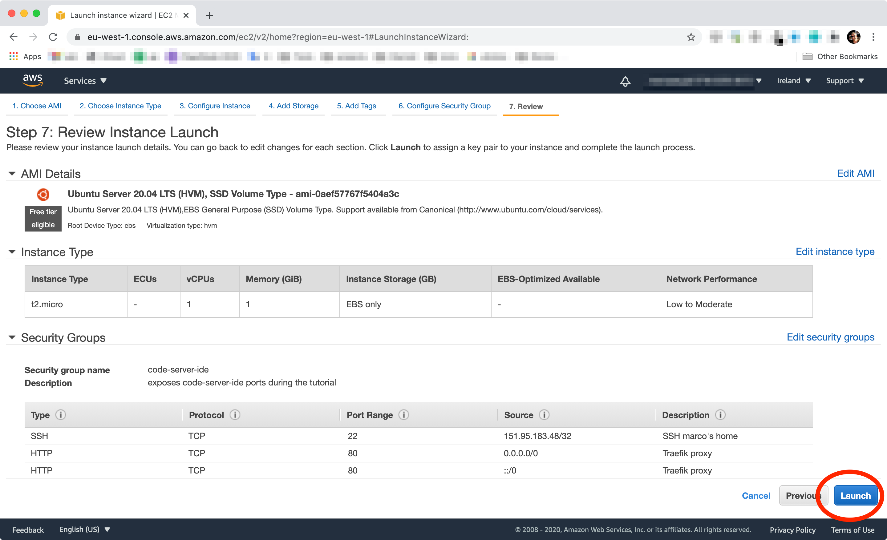

# CodeServer IDE Walkthrough Talk

- [ ] Create an EC2 machine with security group 22, 80, 443, 8080
- [ ] Install CodeServer & run it on 8080
- [ ] Run CodeServer as a Service
      (needed to offer direct ssh access to the machine)
- [ ] Install Docker, DockerCompose, HumbleCLI
- [ ] Run a simple Traefik instance on port 80 (via DockerCompose)
- [ ] Proxy an NGiNX instance through Traefik (via DockerCompose)
- [ ] Proxy CodeServer via NGiNX and Traefik (via DockerCompose)
- [ ] Aim a DNS towards the machine using CloudFlare
      (let’s just do it via REST call using Postmand and cURL)
- [ ] Configure Traefik to generate Letsencrypt certificates (via DockerCompose)

## Create an EC2 machine

### Step 1: Choose an Amazon Machine Image (AMI)

### Step 2: Choose an Instance Type

### Step 3: Configure Instance Details

### Step 4: Add Storage

### Step 5: Add Tags

### Step 6: Configure Security Group

### Step 7: Review Instance Launch

### Check the machine status

